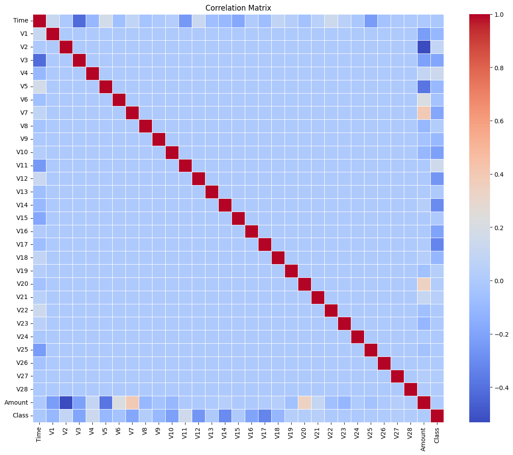
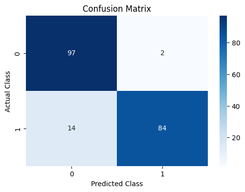
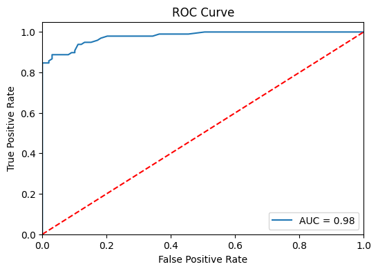
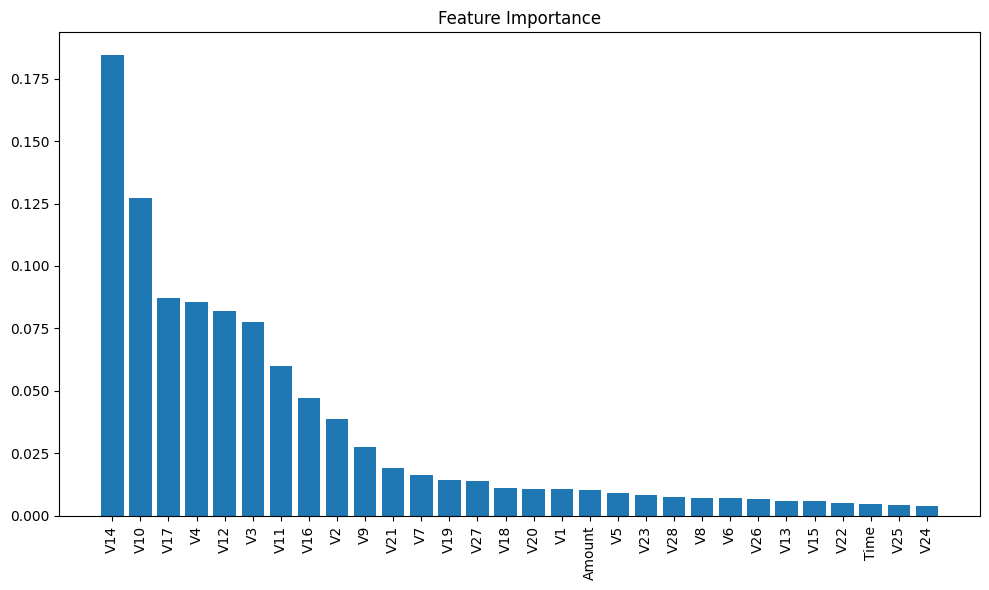

# Credit Card Fraud Detection

The dataset contains transactions made by credit cards in September 2013 by European cardholders.

https://www.kaggle.com/datasets/mlg-ulb/creditcardfraud/data

## Libraries Used
 - numpy
 - pandas
 - sklearn.model_selection
 - sklearn.linear_model
 - sklearn.ensemble
 - sklearn.metrics
 - seaborn

## Data visualisation


```correlation matrix```


```confusion matrix```


```roc curve```


```feature importance```